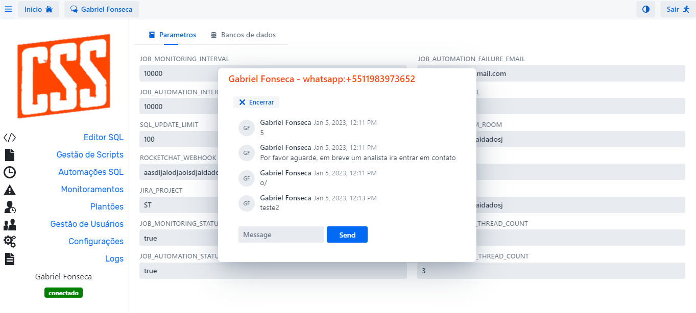
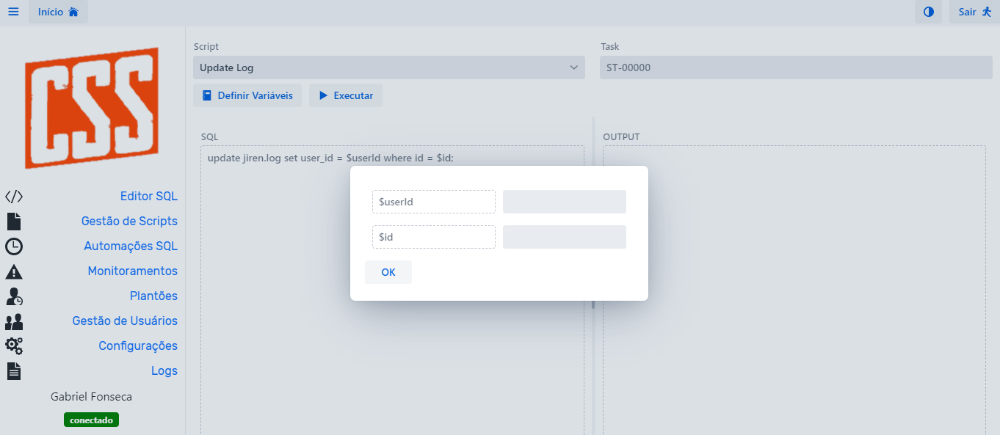
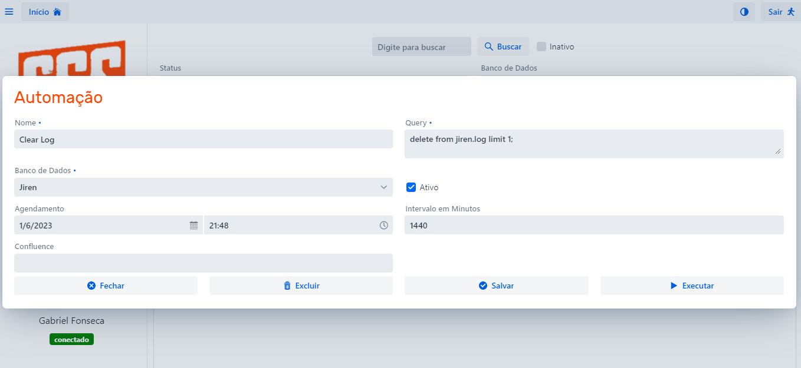
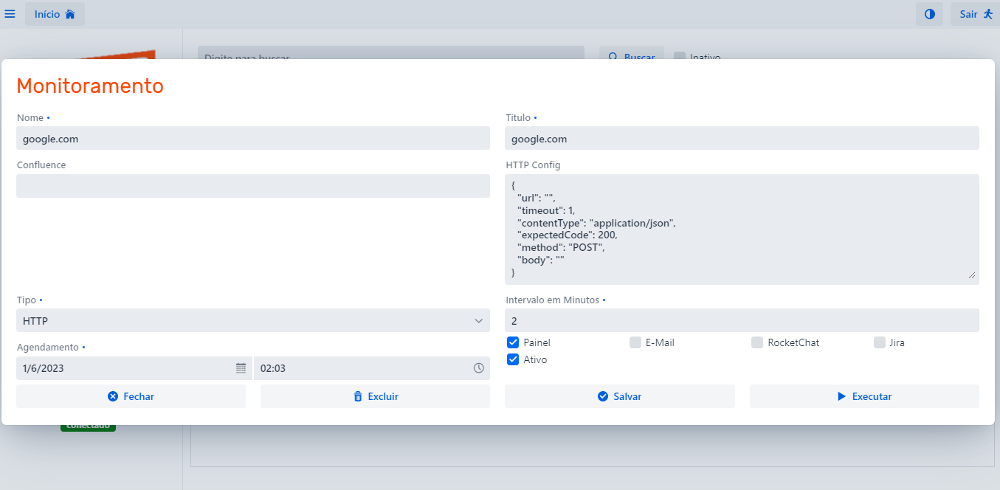

**Jiren**
-
Uma aplicação de gerenciamento e monitoramento de serviços que permite aos usuários acompanhar o status de vários serviços, realizar atualizações controladas em bancos de dados, agendar tarefas SQL e obter suporte online via WhatsApp.

---
**Casos de Uso e Funcionalidades**
-

- LiveChat: Auto-atendimento, comunicação dinâmica e centralizada com o usuário através do whatsapp

- Editor SQL: Execução de scripts SQL através de templates pré-criados/aprovados com logs

- Automações SQL: Execução de scripts agendadas com logs

- Monitoramentos: Monitoramento dos processos e serviços centralizados (HTTP, SQL, NOSQL, SQS, CLOUDWATCH e SAT)

---
**Frameworks & Tecnologias**
-
**Frameworks:** 
- **Springboot**

Spring Boot é um framework de desenvolvimento Java criado pela Spring Source (agora parte da Pivotal) que facilita a criação de aplicações autônomas, de alto desempenho e prontas para produção. Ele utiliza a popular estrutura Spring Framework e fornece uma série de recursos e ferramentas para ajudar os desenvolvedores a construir aplicações Java de forma rápida e fácil, sem a necessidade de configuração excessiva.

- **Vaadin**

Vaadin é uma biblioteca de componentes web open-source para desenvolvimento de aplicativos Java. Ele permite aos desenvolvedores construir aplicativos web baseados em Java de forma rápida e fácil, sem precisar se preocupar com a camada de visualização. Em vez disso, os desenvolvedores podem se concentrar na lógica de negócios do aplicativo.

**Sistema de Build:** Maven

**Linguagem:** Kotlin (Java 17)

**Banco de Dados:** MySQL

**Autenticação:** AWS Cognito

**Credenciais:** AWS Secrets Manager

---
**Config**
-
**Ambiente Produção**

Compile: *mvn clean package -P prod*

A melhor alternativa para executar um webapp escrito em Java com Spring Boot na AWS é usar o Elastic Beanstalk. 

A gestão das credenciais utilizadas pela aplicação é realizada através do AWS Secrets Manager, são necessárias as seguintes credenciais:

Os itens marcados como obrigatórios são essenciais para iniciar o app em produção, os demais são referentes a funcionalidades do app

- database-host: App DB Host (Obrigatório)
- database-schema: App DB Schema (Obrigatório)
- database-user: App DB User (Obrigatório)
- database-password: App DB Password (Obrigatório)
- mailer-user: GMail User (Opcional)
- mailer-password: GMail AppPassword (Opcional)
- jira-user: Jira API User (Opcional)
- jira-password: Jira API Token (Opcional)
- databases-credentials: JSON com os passwords dos BDs utilizados na aplicação (Opcional)
- cognito-clientId: Cognito Client ID (Obrigatório)
- cognito-clientSecret: Cognito Client Secret (Obrigatório)
- twilio-clientId: Twilio Client ID (Opcional)
- twilio-clientSecret: Twilio Client Secret (Opcional)

**Ambiente Local**
- Para executar o app localmente utilize o profile "dev" na compilação  <*mvn clean compile -P dev*>
- Utilize o comando <*mvn spring-boot:run*> para executar
- Edite o arquivo *src/main/resources/application-dev.properties* e defina as configurações de banco de dados
